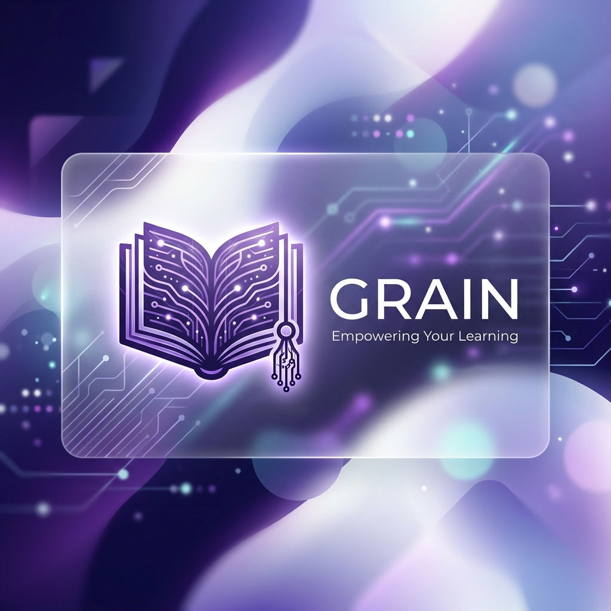

# 

# Grain — Premium Educational Marketplace

**Grain** is a state-of-the-art, full-stack educational ecosystem designed for the modern learner and educator. Built with a "Security-First, UI-Second" philosophy, Grain combines a high-end, tactile bistro-inspired aesthetic with enterprise-grade authentication and real-time interactive features.

---

## 🌟 Platform Highlights

### 🎨 Elite User Experience
- **Responsive Role-Adaptive UI:** A seamless experience that transforms dynamically based on whether you are an Anonymous guest, a Student, or an Administrator.
- **Micro-Animations & Glassmorphism:** Subtle, smooth transitions and frosted-glass components provide a premium, modern feel using GSAP.
- **Comprehensive Settings Dashboard:** A unified account management center for profile updates (Username/Email) and managing course wishlists.
- **Tactile Course Management:** An intuitive, card-based curriculum builder for admins and a streamlined checkout/wishlist flow for students.

### 🔒 Advanced "Ironclad" Security
- **Dual-Token System:** Utilizes **15-minute Access Tokens** (JWT) and **7-day Refresh Tokens** (Crypto-random) for the perfect balance of security and convenience.
- **Laboratory Access Control:** Integrated content gating ensuring video playback is exclusive to registered members, with premium "Locked" UI for guests.
- **Stateful Token Rotation:** Refresh tokens are rotated upon use, preventing replay attacks.
- **Remote Logout All:** Instantly invalidate all active sessions across devices using `tokenVersion` logic.

### ⚡ Innovative Features
- **Advanced "Proper" Search:** A high-speed, debounced search box searching through both **titles and descriptions**. Features full keyboard navigation (Arrows + Enter) and course thumbnails.
- **Smart Heartbeat Mechanism:** Silently verifies session integrity, detecting remote logouts and presenting a custom animated security overlay.
- **Modular Backend Architecture:** Organized with a dedicated configuration layer for database management and JSDoc self-documentation.

---

## 🛠️ Technology Stack

| Layer | Technologies |
| :--- | :--- |
| **Frontend** | React 19, Vite, Tailwind CSS 4, React Router v7, Lucide Icons, GSAP |
| **Backend** | Node.js, Express.js |
| **Database** | MongoDB, Mongoose (TTL Indexes, Soft Deletes) |
| **Auth** | JWT, bcryptjs, Crypto-Rotation, Axios Interceptors |
| **Deployment** | Vercel (Frontend), Railway/Render/Local (Backend) |

---

## 📁 Project Architecture

```text
Grain/
├── backend/                # Enterprise Express.js API
│   ├── src/
│   │   ├── config/         # Modular configuration (DB connections, etc.)
│   │   ├── controllers/    # Business logic (documented with JSDoc)
│   │   ├── middleware/     # Auth, RBAC, and Validation
│   │   ├── models/         # Mongoose Schemas (User, Course, RefreshToken, Blocklist)
│   │   ├── routes/         # RESTful API endpoints
│   │   └── server.js       # Entry point
│   └── package.json
├── frontend/               # Modern React Application
│   ├── src/
│   │   ├── components/     # Atomic UI elements (SearchBox, Navbar, etc.)
│   │   ├── context/        # AuthContext with complex Axios Interceptors
│   │   ├── pages/          # Full-page route components (Settings, Profile, Home)
│   │   ├── App.jsx         # Routing & Protected Route setup
│   │   └── index.css       # Design system & Tailwind 4 config
│   └── package.json
└── assets/                 # Brand assets & documentation media
```

---

## 🔌 API Ecosystem

### 🔑 Authentication & Identity
- `POST /api/auth/signup` - Register with role selection.
- `POST /api/auth/login` - Receive initial Access & Refresh tokens.
- `POST /api/auth/refresh` - Swap an old refresh token for a new pair (Rotation).
- `POST /api/auth/logout-all` - Invalidate sessions on all devices.
- `GET /api/auth/verify` - Heartbeat endpoint for session validation.

### 📚 Course & Content
- `GET /api/courses` - List all active courses.
- `GET /api/courses/search` - Advanced search (Title/Description).
- `POST /api/courses/add` - [Admin] Create a new course curriculum.
- `PUT /api/courses/:id` - [Admin] Update existing course details.
- `DELETE /api/courses/:id` - [Admin] Remove a course from the platform.

### 👤 Profile & Wishlist
- `GET /api/profile` - [Protected] Get personal dashboard data.
- `PUT /api/profile` - [Protected] Update username and email.
- `GET /api/wishlist` - [Protected] Fetch user's saved courses.
- `DELETE /api/wishlist/:courseId` - [Protected] Remove course from wishlist.

---

## 🚀 Execution & Deployment

### Local Development
1. **Clone & Install:**
   ```bash
   npm install && cd backend && npm install && cd ../frontend && npm install
   ```
2. **Environment Configuration:**
   Create a `.env` in `backend/`:
   ```env
   MONGO_URI=your_mongodb_connection_string
   JWT_SECRET=your_ultra_secure_secret
   ```
3. **Run Platform:**
   - Backend: `npm run dev` (from /backend)
   - Frontend: `npm run dev` (from /frontend)

### Vercel Deployment
To deploy the frontend to Vercel, ensure you set the following Environment Variables in the Vercel Dashboard:
- `VITE_API_URL`: The URL of your deployed backend API.
- `VITE_APP_NAME`: `Grain`

---

## 📄 License
Grain is licensed under the MIT License. See `LICENSE` for more details.

---

*Built with ❤️ by the Grain Development Team.*
